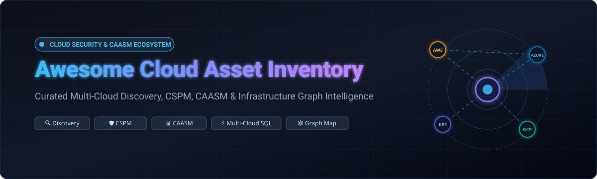

<p align="center">
  
</p>

<p align="center">
  <a href="https://github.com/ishandutta2007/Awesome-Awesome-Awesome"></a><a href="https://discord.gg/jc4xtF58Ve"></a>
  <a href="https://github.com/ishandutta2007/Awesome-Cloud-Asset-Inventory/stargazers"></a>
  <a href="https://github.com/ishandutta2007/Awesome-Cloud-Asset-Inventory/network/members"></a>
  <a href="https://github.com/ishandutta2007/Awesome-Cloud-Asset-Inventory/issues"></a>
  <a href="https://github.com/ishandutta2007/Awesome-Cloud-Asset-Inventory/pulls"></a>
  <a href="https://github.com/ishandutta2007/Awesome-Cloud-Asset-Inventory/blob/main/LICENSE"></a>
  <a href="https://github.com/ishandutta2007"></a>
</p>

# 🌐 Awesome Cloud Asset Inventory

> 🚀 **The Definitive Directory of SaaS Platforms & Open-Source Projects for Cloud Asset Discovery, Multi-Cloud Inventory, Configuration Intelligence, CSPM, CAASM & Infrastructure Graphs.**
>
> 📅 *Last updated: September 2026*

This curated repository tracks the leading commercial SaaS platforms and open-source GitHub projects in the **Cloud Asset Inventory**, **Cyber Asset Attack Surface Management (CAASM)**, and **Cloud Security Posture Management (CSPM)** ecosystem. These solutions automatically discover, normalize, catalog, query via SQL, map as graph databases, and continuously monitor cloud infrastructure assets across **AWS**, **Microsoft Azure**, **Google Cloud (GCP)**, **Kubernetes**, **SaaS applications**, and hybrid enterprise environments.

---

## 📑 Table of Contents

- [☁️ Core Capabilities](#️-core-capabilities)
- [🏢 SaaS & Hosted Platforms](#-saashosted-platforms)
  - [📊 Market Size & Industry Structure](#-market-size--industry-structure)
  - [📋 SaaS Comparison Table](#-saas-comparison-table)
- [🛠️ Open-Source GitHub Projects](#️-open-source-github-projects)
  - [⭐ Open-Source Projects Table (Sorted by Stars)](#-open-source-projects-table-sorted-by-stars)
- [🏗️ Architectural Blueprints & Categories](#️-architectural-blueprints--categories)
- [🤝 How to Contribute](#-how-to-contribute)
- [📈 Star History](#-star-history)
- [⚠️ Disclaimer](#️-disclaimer)

---

## ☁️ Core Capabilities

Cloud asset inventory tools solve visibility and security sprawl by providing:
* 🔍 **Multi-Cloud Asset Discovery**: Continuous inventory of VMs, serverless functions, buckets, IAM policies, databases, containers, and network VPCs across AWS, Azure, GCP, OCI, and Alibaba Cloud.
* 🕸️ **Infrastructure & IAM Graphs**: Graph-based topology mapping showing relationships between identities, roles, compute assets, networks, and potential attack paths.
* 🛡️ **CSPM & Compliance Monitoring**: Real-time evaluation against CIS Benchmarks, NIST CSF, PCI-DSS, SOC 2, HIPAA, and ISO 27001.
* ⚡ **SQL-Over-Cloud APIs**: Zero-ETL SQL engines that allow engineers to query live infrastructure like relational database tables.
* 📊 **Cyber Asset Attack Surface Management (CAASM)**: Unified asset inventory correlating security telemetry, vulnerability scanners, and IT management systems.
* 📜 **Configuration Intelligence & Drift**: Historical change tracking, drift detection, and automated remediation.

---

## 🏢 SaaS/Hosted Platforms

### 📊 Market Size & Industry Structure

> 💡 **Market Size & Structure**: The global Cloud Security Posture Management (CSPM), CAASM, and Cloud Asset Inventory market is estimated at **$5.5 Billion in 2024 and projected to reach $15.2 Billion by 2030 (CAGR ~18.5%)**. The sector is **moderately fragmented but rapidly consolidating** into converged Cloud-Native Application Protection Platforms (CNAPP). Hyperscalers and mega-cap security conglomerates (Microsoft, Google, Palo Alto Networks, Fortinet) dominate broad suites, while specialized category leaders (Wiz, Orca, Axonius, Datadog) drive cutting-edge innovation in agentless scanning, asset graph analytics, and multi-source CAASM aggregation.

### 📋 SaaS Comparison Table

*The table below is sorted in descending order by company valuation, market capitalization, or annual revenue.*

| 🏢 Product | 📝 Description | 💰 Company Valuation / Revenue | 🏷️ Starting Tier / Pricing | 🎁 Free Tier Limit / Free Trial Details |
| :--- | :--- | :--- | :--- | :--- |
| **[Microsoft Defender for Cloud](https://azure.microsoft.com/en-us/products/defender-for-cloud)** | Comprehensive cloud security platform providing posture management, asset inventory, recommendations, compliance monitoring, and multi-cloud workload protection. | **$3.10T Market Cap**<br>*(Microsoft: ~$245B+ Rev)* | Foundational CSPM is **$0.00 (Free)**; Defender for Servers starts at **$5.00–$15.00/server/month**; Defender CSPM at **$5.11/billable resource/month**. | **Free forever** for Foundational CSPM (continuous multi-cloud asset discovery, Secure Score, MCSB benchmarks); **30-day free trial** for all paid plans. |
| **[Microsoft Defender CSPM](https://azure.microsoft.com/en-us/products/defender-for-cloud)** | Dedicated cloud security posture management offering attack-path analysis, agentless vulnerability scanning, data-aware posture, and security graph insights. | **$3.10T Market Cap**<br>*(Microsoft: ~$245B+ Rev)* | **$5.11 per billable resource/month** (metered hourly across compute, database, storage, and serverless assets). | **30-day free trial** per subscription/tenant (baseline asset posture and recommendations covered by Foundational CSPM free forever). |
| **[Google Cloud Asset Inventory](https://cloud.google.com/asset-inventory)** | Native GCP metadata service for searching, exporting, monitoring, and analyzing Google Cloud assets and IAM policies in real time. | **$2.15T Market Cap**<br>*(Alphabet: ~$350B+ Rev)* | **$0.00 (Free)** for all core Asset Inventory API searches, exports, and IAM policy analysis calls (standard GCP storage/BigQuery rates apply to exported sinks). | **Free forever** with unlimited API search and export calls across organization assets (subject to standard GCP per-project API rate quotas). |
| **[ServiceNow CMDB (ITOM Discovery)](https://www.servicenow.com/products/it-operations-management.html)** | Enterprise configuration management database platform integrating automated discovery and cloud asset mapping into a centralized service ecosystem. | **$170B Market Cap**<br>*(ServiceNow: ~$10.0B Rev)* | ITOM Discovery / ITSM packages start at **~$90.00–$200.00/user/month** or **~$30.00–$45.00/node/year** (enterprise contracts typically start ~$10,000–$40,000+/year). | **Personal Developer Instance (PDI) Free forever** on the ServiceNow Developer Portal (full CMDB schema and discovery workflows for testing; must stay active). |
| **[Palo Alto Networks Prisma Cloud](https://www.paloaltonetworks.com/prisma/cloud)** | Comprehensive CNAPP combining multi-cloud asset visibility, CSPM, CIEM, container/workload protection, and infrastructure security. | **$115B Market Cap**<br>*(Palo Alto: ~$8.0B Rev)* | Credit-based model starting at **~$300–$640 per Prisma Cloud Credit/year** (starter deployment bundles typically start at ~$10,800/year). | **30-day free trial** on Prisma Cloud portal (15-day free trial with initial test credits on AWS Marketplace; no perpetual free tier). |
| **[Randori (Palo Alto Networks)](https://www.paloaltonetworks.com/cortex/cortex-xpanse)** | Attack surface management and exposure validation platform providing continuous discovery and prioritization of externally facing infrastructure. | **$115B Market Cap**<br>*(Palo Alto: ~$8.0B Rev)* | Enterprise contracts historically start at **~$15,000/year** (now integrated into Palo Alto Networks Cortex XPANSE / ASM portfolio). | **7-day to 14-day** scoped attack surface review / Proof-of-Concept assessment (no perpetual free tier). |
| **[Lacework (FortiCNAPP)](https://www.fortinet.com/products/forticnapp)** | Cloud security and CNAPP platform providing cloud asset visibility, Polygraph anomaly detection, workload security, and posture management. | **$60B Parent Cap**<br>*(Fortinet: ~$5.5B Rev; acquired 2024)* | Custom enterprise contracts starting at **~$36,000/year** (or ~$360/workload/year for legacy starter tiers). | **14-day guided Cloud Security Assessment (CSA)** / PoC evaluation (no perpetual free tier). |
| **[Datadog Cloud Security Management](https://www.datadoghq.com/product/cloud-security-management/)** | Observability-integrated security platform unifying cloud resource inventory, configuration compliance, vulnerability detection, and threat monitoring. | **$38B Market Cap**<br>*(Datadog: ~$2.6B Rev)* | **CSM Pro starts at $10.00/host/month** (billed annually, or $12.00 on-demand); **CSM Enterprise starts at $25.00/host/month** ($30.00 on-demand). | **14-day free trial** with full platform access (CSM, CSPM, and threat detection across connected infrastructure; no perpetual free tier). |
| **[Check Point CloudGuard](https://www.checkpoint.com/cloudguard/)** | Cloud-native security platform offering multi-cloud asset visibility, CSPM, workload protection, and automated compliance management. | **$21B Market Cap**<br>*(Check Point: ~$2.5B Rev)* | Starts at **~$36.00–$50.00/asset/year** (~$3.00–$4.17/asset/month) on annual contracts, or pay-as-you-go per VM instance hour on AWS/Azure. | **30-day free trial** on AWS Marketplace and direct portal (full security feature evaluation up to trial limits; no perpetual free tier). |
| **[Wiz](https://www.wiz.io/)** | Agentless cloud security platform that discovers cloud resources and relationships across multi-cloud environments, connecting assets with vulnerabilities, IAM, and attack paths. | **$12.0B Valuation**<br>*(ARR: ~$500M+)* | Custom enterprise subscription starting at **~$30,000–$50,000/year** (licensed in blocks of 100 workloads across Cloud, Code, and Sensor modules). | **14-day guided Proof of Concept (PoC)** / cloud risk assessment trial (no perpetual free tier). |
| **[Tenable Cloud Security](https://www.tenable.com/products/tenable-cloud-security)** | Cloud-native security platform providing visibility into cloud infrastructure, IAM permissions, configurations, and vulnerabilities across public clouds. | **$5.0B Market Cap**<br>*(Tenable: ~$850M Rev)* | Enterprise contracts starting at **~$150–$350/resource/year** (or via Tenable One asset licensing starting at ~$2,275/year base packs). | **30-day free trial** available via AWS Marketplace / web portal request (full CNAPP & CIEM evaluation; no perpetual free tier). |
| **[Device42 (Freshworks)](https://www.device42.com/)** | Hybrid IT and cloud asset discovery platform providing automated infrastructure mapping, dependency tracking, and configuration management. | **$3.8B Parent Cap**<br>*(Acquired for $230M; Freshworks Rev ~$600M+)* | Starts at **~$1,449.00/year** (~$2.50–$4.50/device/month) for core discovery and inventory, scaling with monitored device tiers. | **14-day free trial** limited to 100 devices (no credit card required; no perpetual free tier). |
| **[Axonius](https://www.axonius.com/)** | Cybersecurity Asset Attack Surface Management (CAASM) platform consolidating devices, identities, cloud infrastructure, and SaaS apps into a unified inventory. | **$2.6B Valuation**<br>*(ARR: ~$100M+)* | Annual enterprise subscription starting at **~$25,000–$35,000/year** (~$3.00–$5.00/asset/month scaled by total unified assets). | **14-day guided proof-of-concept** / interactive sandbox demo (no perpetual free tier). |
| **[Sysdig Secure](https://sysdig.com/products/secure/)** | Cloud and Kubernetes security platform providing real-time asset discovery, vulnerability management, posture analysis (CSPM), and runtime threat detection. | **$2.5B Valuation**<br>*(ARR: ~$100M+)* | Starts at **$15.00–$40.00/host/month** (billed annually, or $0.007/compute hour); enterprise deployments average $40.00–$120.00/host/month. | **30-day free trial** with full CNAPP and Kubernetes security features across connected hosts and clusters (no perpetual free tier). |
| **[Rapid7 InsightCloudSec](https://www.rapid7.com/products/insightcloudsec/)** | Multi-cloud security and compliance platform providing continuous asset visibility, posture management, IAM governance, and automated remediation. | **$2.5B Market Cap**<br>*(Rapid7: ~$820M Rev)* | Asset-based pricing starting at **~$5,000–$6,000/month** (~$60,000–$66,000/year billed annually) for up to 500 billable cloud instances. | **30-day proof-of-concept** / guided evaluation environment (no perpetual free tier). |
| **[Orca Security](https://orca.security/)** | Agentless CNAPP platform delivering automated cloud asset discovery, vulnerability analysis, identity mapping, and contextual risk management. | **$1.8B Valuation**<br>*(ARR: ~$50M+)* | Annual contracts typically starting at **~$15,000/year** (~$39–$45/workload/year for core CSPM/CWPP modules). | **30-day full-featured free trial** available on AWS Marketplace and official portal (no perpetual free tier). |
| **[Aqua Security](https://www.aquasec.com/)** | Cloud-native application protection platform (CNAPP) providing visibility and risk control across containers, Kubernetes, serverless, and cloud infrastructure. | **$1.0B Valuation**<br>*(Unicorn, $265M raised)* | Enterprise subscriptions start at **~$3,500–$10,000/year** (based on workload units and code repositories; open-source Trivy/Tracee tools are free). | **14-day free trial** for Aqua CSPM Advanced on AWS Marketplace; **perpetually free Developer tier** for basic container scanning. |
| **[JupiterOne](https://www.jupiterone.com/)** | Cyber asset intelligence platform using a graph data model to map relationships, permissions, compliance, and vulnerabilities across cyber assets. | **$1.0B Valuation**<br>*(Series C, $119M raised)* | Starter/Mid-Market plans start at **~$500.00/month** (~$6,000/year for up to 200,000 data points); custom quotes for enterprise tiers. | **Free Community tier forever** (basic asset inventory and compliance tracking for startups, limited to 10 API requests/minute); **14-day free trial** for paid tiers. |
| **[CyCognito](https://www.cycognito.com/)** | External attack surface management (EASM) platform autonomously discovering, classifying, and prioritizing exposed organizational and cloud-connected assets. | **~$800M Valuation**<br>*(Series C, $165M raised)* | Annual enterprise contracts typically start at **~$20,000–$30,000/year** (scaled by external asset scope and scanning frequency). | **Free Attack Surface Risk Assessment** (scoped single scan/evaluation for a specific subsidiary or asset group; no perpetual free tier). |
| **[Censys](https://censys.com/)** | Internet intelligence and Attack Surface Management (ASM) platform identifying exposed cloud assets, services, certificates, and entry points. | **~$500M Valuation**<br>*(Series B, $115M raised)* | Censys Search Community is **$0.00**; Search Starter begins at **$100.00** (prepaid search credits); Censys ASM enterprise starts at **~$60,000/year**. | **Free Community tier forever** (100 search credits / up to 250 queries/month for basic host and certificate lookups); **30-day free trial** for Search Pro / **14-day trial** for ASM. |
| **[CloudQuery](https://www.cloudquery.io/)** | High-performance data integration platform that syncs multi-cloud infrastructure and security configurations into SQL-compatible databases and data warehouses. | **~$80M–$100M Valuation**<br>*(Series A, $15M raised)* | AWS Marketplace Starter package starts at **$44,516/year** (1.2 billion synced rows + Silver support); self-hosted open-source CLI is free. | **14-day free trial** for CloudQuery Cloud; **monthly free sync quota** for official cloud source plugins without credit card; open-source core SDK is free forever. |
| **[Steampipe (Turbot Pipes)](https://turbot.com/pipes)** | SQL-first cloud intelligence platform enabling real-time queries, dashboards, and compliance checks across cloud providers and SaaS APIs. | **~$50M Valuation**<br>*(Seed / Venture-backed)* | Developer plan is **$0.00 (Free)**; Team plan starts at **$49.00/month** (includes 3 users, 2,000 compute minutes, 20 GB storage; $19/additional user/month); Enterprise at **$249.00/month**. | **Developer plan is Free forever** (1 user, 400 compute minutes/month, 3 GB storage, 5 workspaces); Steampipe open-source CLI and plugins are free forever. |

---

## 🛠️ Open-Source GitHub Projects

The open-source ecosystem provides modular, transparent, self-hosted building blocks for multi-cloud discovery, zero-ETL SQL querying, infrastructure relationship graphs, policy enforcement, and security auditing.

### ⭐ Open-Source Projects Table (Sorted by Stars)

*Each repository includes a live GitHub star badge that links directly to its stargazers page.*

| 🚀 Project | ⭐ Github_Stars | 📂 Focus Area | 📝 Description |
| :--- | :--- | :--- | :--- |
| **[Apache Superset](https://github.com/apache/superset)** | [](https://github.com/apache/superset/stargazers) | BI & Inventory Dashboards | Modern open-source data exploration and business intelligence visualization platform for querying and dashboarding multi-cloud asset inventories. |
| **[Grafana](https://github.com/grafana/grafana)** | [](https://github.com/grafana/grafana/stargazers) | Metrics & Inventory Dashboards | Leading open-source operational visualization and dashboarding platform for monitoring multi-cloud infrastructure assets, metrics, and security trends. |
| **[Metabase](https://github.com/metabase/metabase)** | [](https://github.com/metabase/metabase/stargazers) | SQL Analytics & Visualization | User-friendly open-source business intelligence and reporting platform for fast querying and visualizing cloud asset database tables. |
| **[Apache Airflow](https://github.com/apache/airflow)** | [](https://github.com/apache/airflow/stargazers) | Discovery Pipeline Orchestration | Open-source workflow orchestration platform for scheduling and automating complex cloud asset discovery, normalization, and enrichment pipelines. |
| **[Backstage](https://github.com/backstage/backstage)** | [](https://github.com/backstage/backstage/stargazers) | Developer Portal & Asset Catalog | Open-source developer portal platform created by Spotify for centralizing software catalogs, service ownership, infrastructure inventory, and API metadata. |
| **[Snipe-IT](https://github.com/snipe/snipe-it)** | [](https://github.com/snipe/snipe-it/stargazers) | ITAM & Hardware/Cloud Asset Inventory | Widely adopted open-source IT asset management (ITAM) platform for tracking hardware, cloud software licenses, user assignments, and digital infrastructure. |
| **[Trivy](https://github.com/aquasecurity/trivy)** | [](https://github.com/aquasecurity/trivy/stargazers) | Vulnerability & Cloud Misconfig Scanner | Comprehensive open-source security scanner that scans container images, file systems, Git repositories, AWS/GCP/Azure cloud configurations, and Kubernetes for vulnerabilities and misconfigurations. |
| **[Prowler](https://github.com/prowler-cloud/prowler)** | [](https://github.com/prowler-cloud/prowler/stargazers) | Multi-Cloud CSPM & Security Assessment | Major open-source cloud security platform supporting AWS, Azure, GCP, Kubernetes, and Microsoft 365. Combines asset discovery with security assessments, compliance checks, continuous monitoring, and automated remediation. |
| **[Node-RED](https://github.com/node-red/node-red)** | [](https://github.com/node-red/node-red/stargazers) | Low-Code Automation & Event Flow | Low-code flow-based programming tool for connecting cloud APIs, inventory webhooks, alerts, and automated remediation workflows. |
| **[Prefect](https://github.com/PrefectHQ/prefect)** | [](https://github.com/PrefectHQ/prefect/stargazers) | Modern Dataflow & Ingestion | Modern open-source data workflow orchestration platform designed to build, schedule, and monitor resilient cloud asset synchronization pipelines. |
| **[PostgreSQL](https://github.com/postgres/postgres)** | [](https://github.com/postgres/postgres/stargazers) | Relational Asset Storage | Standard open-source relational database widely used as the primary storage and query layer for normalized multi-cloud asset inventories. |
| **[NetBox](https://github.com/netbox-community/netbox)** | [](https://github.com/netbox-community/netbox/stargazers) | Infrastructure Source of Truth / DCIM | Leading open-source Infrastructure Resource Modeling (IRM) and Source of Truth platform for modeling networks, IP addresses, data centers, and hybrid cloud compute assets. |
| **[Neo4j Community](https://github.com/neo4j/neo4j)** | [](https://github.com/neo4j/neo4j/stargazers) | Graph Database Engine | Leading native graph database technology used to power cloud asset relationship graphs, IAM permission paths, and multi-cloud infrastructure topologies. |
| **[OWASP Amass](https://github.com/owasp/amass)** | [](https://github.com/owasp/amass/stargazers) | Attack Surface & External Asset Discovery | In-depth attack surface mapping and external asset discovery tool utilizing information gathering and graph database storage. |
| **[Infracost](https://github.com/infracost/infracost)** | [](https://github.com/infracost/infracost/stargazers) | FinOps & Cloud Asset Cost Shifts | Open-source tool that provides real-time cloud cost estimates for Terraform and OpenTofu infrastructure assets before they are deployed. |
| **[Kubescape](https://github.com/kubescape/kubescape)** | [](https://github.com/kubescape/kubescape/stargazers) | Kubernetes Security & Risk Analysis | Open-source Kubernetes security platform providing automated risk analysis, asset compliance auditing, and RBAC posture visualization. |
| **[Subfinder](https://github.com/projectdiscovery/subfinder)** | [](https://github.com/projectdiscovery/subfinder/stargazers) | Subdomain & Surface Enumeration | Fast passive subdomain discovery tool designed to map external-facing cloud attack surfaces and valid domain assets. |
| **[Crossplane](https://github.com/crossplane/crossplane)** | [](https://github.com/crossplane/crossplane/stargazers) | Declarative Multi-Cloud Control Planes | Open-source Kubernetes add-on that enables platform teams to build customized control planes and manage multi-cloud infrastructure as declarative Kubernetes custom resources. |
| **[Open Policy Agent (OPA)](https://github.com/open-policy-agent/opa)** | [](https://github.com/open-policy-agent/opa/stargazers) | Policy-as-Code Engine | Open-source general-purpose policy engine with a declarative language (Rego) used to enforce context-aware compliance over cloud inventory and infrastructure data. |
| **[OpenSearch](https://github.com/opensearch-project/OpenSearch)** | [](https://github.com/opensearch-project/OpenSearch/stargazers) | Search & Configuration Analytics | Open-source search and analytics suite suitable for indexing, searching, and visualizing petabyte-scale cloud asset inventories and configuration logs. |
| **[CloudQuery](https://github.com/cloudquery/cloudquery)** | [](https://github.com/cloudquery/cloudquery/stargazers) | Multi-Cloud ELT / Data Sync Engine | Open-source high-performance data integration engine for synchronizing cloud configuration and security data into databases (PostgreSQL, Snowflake, BigQuery) for CSPM, FinOps, and asset inventory. |
| **[Checkov](https://github.com/bridgecrewio/checkov)** | [](https://github.com/bridgecrewio/checkov/stargazers) | IaC Static Analysis & Asset Governance | Static analysis tool for Infrastructure as Code (IaC) to detect security and compliance misconfigurations across Terraform, CloudFormation, Kubernetes, ARM, and Bicep. |
| **[Steampipe](https://github.com/turbot/steampipe)** | [](https://github.com/turbot/steampipe/stargazers) | Zero-ETL SQL Engine over APIs | Open-source zero-ETL SQL engine for querying live cloud APIs, SaaS platforms, and infrastructure services as relational database tables. |
| **[Cartography](https://github.com/lyft/cartography)** | [](https://github.com/lyft/cartography/stargazers) | Infrastructure Asset Graph Mapping | Open-source Python tool that consolidates cloud infrastructure assets and complex relationships into a Neo4j graph database for attack path analysis and multi-cloud visibility. |
| **[Kyverno](https://github.com/kyverno/kyverno)** | [](https://github.com/kyverno/kyverno/stargazers) | Kubernetes Policy & Governance Engine | Open-source Kubernetes-native policy engine that validates, mutates, generates, and audits Kubernetes resource configurations and admission policies. |
| **[Cloud Custodian](https://github.com/cloud-custodian/cloud-custodian)** | [](https://github.com/cloud-custodian/cloud-custodian/stargazers) | Cloud Governance & Remediation Rules Engine | Open-source rules engine for cloud security, governance, compliance, and cost management with policy-as-code enforcement. |
| **[kube-state-metrics](https://github.com/kubernetes/kube-state-metrics)** | [](https://github.com/kubernetes/kube-state-metrics/stargazers) | Kubernetes Cluster Object State Metrics | Kubernetes core add-on agent that listens to the Kubernetes API and generates metrics about the state of deployments, nodes, pods, and cluster assets. |
| **[OpenCost](https://github.com/opencost/opencost)** | [](https://github.com/opencost/opencost/stargazers) | Kubernetes Workload & Cost Allocation | Open-source, CNCF-hosted Kubernetes cost monitoring, resource utilization, and workload asset tracking tool. |
| **[GLPI](https://github.com/glpi-project/glpi)** | [](https://github.com/glpi-project/glpi/stargazers) | IT Asset & Service Management | Comprehensive open-source IT asset and service management platform with automated discovery capabilities for physical and cloud-connected assets. |
| **[Naabu](https://github.com/projectdiscovery/naabu)** | [](https://github.com/projectdiscovery/naabu/stargazers) | Network Port & Exposure Scanner | Fast and reliable port scanner focused on discovering exposed network services and cloud-hosted ports. |
| **[OpenTelemetry Collector](https://github.com/open-telemetry/opentelemetry-collector)** | [](https://github.com/open-telemetry/opentelemetry-collector/stargazers) | Infrastructure Telemetry & Metadata | Vendor-agnostic telemetry collector for gathering infrastructure metadata, traces, metrics, and service relationships across multi-cloud environments. |
| **[ScoutSuite](https://github.com/nccgroup/ScoutSuite)** | [](https://github.com/nccgroup/ScoutSuite/stargazers) | Multi-Cloud Security Auditing | Open-source multi-cloud security auditing toolkit that gathers cloud configuration posture across AWS, Azure, GCP, Alibaba Cloud, and Oracle Cloud. |
| **[Komiser](https://github.com/tailwarden/komiser)** | [](https://github.com/tailwarden/komiser/stargazers) | Cloud Discovery & Cost Dashboard | Open-source cloud environment inspector and resource discovery dashboard for AWS, GCP, Azure, DigitalOcean, and Civo. |
| **[CloudMapper](https://github.com/duo-labs/cloudmapper)** | [](https://github.com/duo-labs/cloudmapper/stargazers) | AWS Visual Topology & Network Maps | Open-source AWS network and infrastructure visualization tool that creates topology diagrams and security audit reports. |
| **[Ralph](https://github.com/allegro/ralph)** | [](https://github.com/allegro/ralph/stargazers) | DCIM & Asset Tracking System | Open-source asset management, data center infrastructure management (DCIM), and hybrid hardware/virtual asset tracking platform. |
| **[Apache AGE](https://github.com/apache/age)** | [](https://github.com/apache/age/stargazers) | PostgreSQL Graph Database Extension | Open-source PostgreSQL graph extension implementing OpenCypher graph querying over relational PostgreSQL cloud asset databases. |
| **[CloudSploit](https://github.com/aquasecurity/cloudsploit)** | [](https://github.com/aquasecurity/cloudsploit/stargazers) | Cloud Security & Compliance Auditing | Open-source cloud security posture and configuration scanner supporting AWS, Azure, GCP, and Oracle Cloud Infrastructure. |
| **[CloudFox](https://github.com/BishopFox/cloudfox)** | [](https://github.com/BishopFox/cloudfox/stargazers) | Cloud Recon & Attack Path Enumeration | Open-source command-line cloud reconnaissance and enumeration tool designed to discover situational awareness and attack paths in AWS and Azure environments. |
| **[Fix Inventory](https://github.com/someengineering/fixinventory)** | [](https://github.com/someengineering/fixinventory/stargazers) | Multi-Cloud Inventory Graph | Open-source multi-cloud inventory engine (formerly Resoto) collecting cloud infrastructure into an indexed, queryable data graph. |
| **[ElectricEye](https://github.com/jonrau1/ElectricEye)** | [](https://github.com/jonrau1/ElectricEye/stargazers) | Multi-Cloud & SaaS Posture Auditing | Open-source multi-cloud and multi-SaaS asset inventory and posture management scanner that continuously audits configurations against compliance benchmarks. |
| **[CMDBuild](https://github.com/cmdbuild/cmdbuild)** | [](https://github.com/cmdbuild/cmdbuild/stargazers) | Open-Source Enterprise CMDB | Open-source enterprise configuration management database (CMDB) designed to model complex IT asset topologies, dependencies, and lifecycle states. |
| **[Port Ocean](https://github.com/port-labs/ocean)** | [](https://github.com/port-labs/ocean/stargazers) | Live Infrastructure Exporters for IDP | Open-source framework for building extensible data exporters and live infrastructure discovery integrations for internal developer portals. |

---

## 🏗️ Architectural Blueprints & Categories

When designing a production-grade, self-hosted Cloud Asset Inventory and Governance system, combine open-source components across these modular tiers:

```
┌─────────────────────────────────────────────────────────────────────────────┐
│                       VISUALIZATION & DEVELOPER PORTALS                     │
│           Backstage  •  Apache Superset  •  Grafana  •  Metabase            │
└──────────────────────────────────────┬──────────────────────────────────────┘
                                       │
┌──────────────────────────────────────▼──────────────────────────────────────┐
│                        POLICY & REMEDIATION ENGINES                         │
│            Cloud Custodian  •  Open Policy Agent (OPA)  •  Kyverno          │
└──────────────────────────────────────┬──────────────────────────────────────┘
                                       │
┌──────────────────────────────────────▼──────────────────────────────────────┐
│                     STORAGE & GRAPH RELATIONSHIP ENGINES                    │
│      PostgreSQL  •  Neo4j Community  •  Apache AGE  •  OpenSearch           │
└──────────────────────────────────────┬──────────────────────────────────────┘
                                       │
┌──────────────────────────────────────▼──────────────────────────────────────┐
│                    DISCOVERY & ZERO-ETL INGESTION ENGINES                   │
│        CloudQuery  •  Steampipe  •  Cartography  •  Prowler  •  Trivy       │
└──────────────────────────────────────┬──────────────────────────────────────┘
                                       │
┌──────────────────────────────────────▼──────────────────────────────────────┐
│                         MULTI-CLOUD INFRASTRUCTURE                          │
│     AWS  •  Microsoft Azure  •  Google Cloud  •  Kubernetes  •  SaaS IAM     │
└─────────────────────────────────────────────────────────────────────────────┘
```

1. **Multi-Cloud Data Collectors**: Use [CloudQuery](https://github.com/cloudquery/cloudquery) to extract raw metadata into PostgreSQL or use [Steampipe](https://github.com/turbot/steampipe) for ad-hoc zero-ETL querying across AWS, Azure, GCP, and Kubernetes.
2. **Infrastructure Relationship Graphs**: Deploy [Cartography](https://github.com/lyft/cartography) with [Neo4j](https://github.com/neo4j/neo4j) or [Apache AGE](https://github.com/apache/age) to expose IAM attack paths and cross-resource dependencies.
3. **CSPM & Security Enrichment**: Run [Prowler](https://github.com/prowler-cloud/prowler) and [Trivy](https://github.com/aquasecurity/trivy) to continuously flag misconfigurations, public exposures, and vulnerable images.
4. **Policy Enforcement & Drift Remediation**: Leverage [Cloud Custodian](https://github.com/cloud-custodian/cloud-custodian) and [Open Policy Agent (OPA)](https://github.com/open-policy-agent/opa) to automatically quarantine non-compliant assets.
5. **Unified Catalog & Dashboards**: Integrate with [Backstage](https://github.com/backstage/backstage) for service catalog mapping and [Apache Superset](https://github.com/apache/superset) or [Grafana](https://github.com/grafana/grafana) for executive posture dashboards.

---

## 🤝 How to Contribute

Contributions to this ecosystem are warmly welcome! To add or update an entry:

1. 🍴 **Fork** this repository.
2. 📝 **Add/Edit** entries in `README.md` following the existing format.
3. 🔗 **Include**: Tool name, official link, GitHub star badge (for open source), 1–2 sentence description, pricing tier, and free limits.
4. 🚀 **Submit a Pull Request** with a concise description of the addition.
5. ⭐ **Star the repository** if you find it helpful!

---

## 📈 Star History

[](https://star-history.dera.page/#ishandutta2007/Awesome-Cloud-Asset-Inventory&type=date&legend=top-left)

---

## ⚠️ Disclaimer

* This is a community-curated list and does not constitute an official endorsement of any vendor or tool.
* Cloud asset inventories can become incomplete if API permissions, regions, sub-accounts, or Kubernetes clusters are not properly connected.
* Always review and test automated remediation policies in staging environments before deploying to production.
* Pricing and free tier quotas are subject to vendor updates; please verify with the respective provider.
* Cloud configuration and asset inventory data can contain sensitive identity, network, and topology details—ensure proper encryption and role-based access controls (RBAC) are enforced.

---

<p align="center">
  <b>Built with ❤️ for Cloud Engineers, Platform Teams, DevOps &amp; Security Architects worldwide.</b><br>
  <i>Let's make cloud asset discovery open, queryable, transparent, and under your control.</i>
</p>
